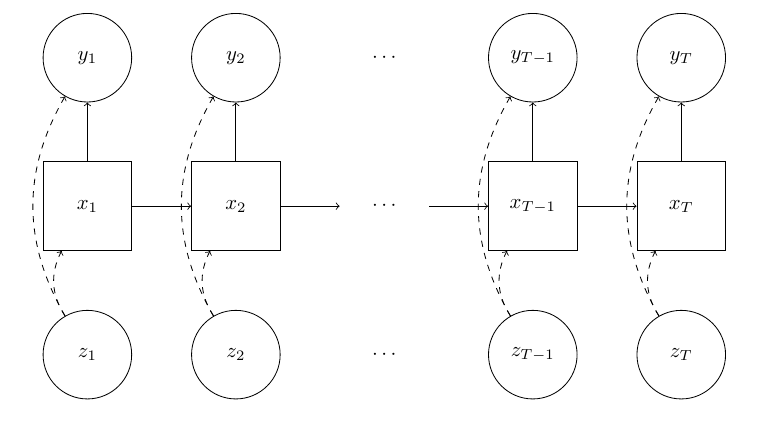

```{r setup, include=FALSE}
knitr::opts_chunk$set(echo = FALSE)
```


## State-space models!


```{r, out.width="100%"}

```

$\{y_t\}$: time series, $\{x_t\}$: hidden states, $\{z_t\}$: inputs


## State-space models

Defining a state-space model requires defining

 - $g(y_t \mid x_t, \theta)$ observation distributions,
 - $f(x_t \mid x_{t-1}, \theta)$ state transition distributions, and 
 - $\mu(x_t \mid \theta)$ an initial state distribution.

If you're Bayesian, you might also pick a prior $\pi(\theta)$.

## Inference

Statistical inference can target:

  - states (assuming parameters are known),
  - parameters (ignoring states), or 
  - both states and parameters simultaneously.

  
## State Inference


Filtering distributions are

 - $p(x_t \mid y_{1:t}, \theta)$,
 - found by recursively applying Bayes' rule,
 - a tool for forecasting, and
 - approximated with **weighted samples** in particle filters.


## Parameter Inference


The likelihood $p(y_{1:T} \mid \theta)$ is *often intractable*!

   - Frequentists will have difficulty optimizing it.
   - Bayesians will have difficulty integrating it.

Particle filters give us a **random approximate evaluation**.


## Problems


Unfortunately, particle filters are tricky business:

 - running them in interpreted languages is slow,
 - writing them in compiled code is slow,
 - there are so many to choose from, and
 - they're difficult or impossible to parallelize.


## The Solution

`pfR` is the R interface to `pf` (a C++ particle filtering library).


`pf` is fast, but...

 - lots of boilerplate
 - pure C++


## The Solution


`pfR` automatically generates 99% of the code!

Each model/algorithm pair gets its own class. For each pair, generate

  1. a header file,
  2. source file with model definition, and
  3. export code to use c++ stuff from within R.


## The Solution


Pick an algorithm and name your model by running one of these:

```{r, eval=FALSE, echo=TRUE}
pfr::createSISRFilterTemplate("my_model")
pfr::createAuxiliaryFilterTemplate("my_model")
pfr::createBootstrapFilterTemplate("my_model")
pfr::createBootstrapFilterWithCovTemplate("my_model")
pfr::createRBPFHmmTemplate("my_model")
pfr::createRBPFKalmanTemplate("my_model")
```

and edit `my_model_sisr.h`, `my_model_sisr.cpp` and `my_model_sisr_export.cpp`.


Demo video on the [Github repo](https://github.com/tbrown122387/pfR).


## The Solution

Compile with <kbd>Ctrl</kbd> + <kbd>Shift</kbd> + <kbd>L</kbd> (or `devtools::load_all(".")`)


Run log-likelihood and filtering functions:

```
pfr::my_model_bswc_approx_filt(myData, myParams)
pfr::my_model_bswc_approx_LL(myData, myParams)
```


Demo video on the [Github repo](https://github.com/tbrown122387/pfR).


## Two Examples!


```{r, echo=FALSE, eval = TRUE, message=FALSE, warning=FALSE}
tickers <- c("SPY","QQQ")
quantmod::getSymbols(tickers)
rets <- lapply(tickers, \(x) { 100*diff(log(quantmod::Ad(get(x)))) } )
plot(cbind(log(quantmod::Ad(SPY)),
           log(quantmod::Ad(QQQ))), 
     main = "", multi.panel = T)
rets <- as.matrix(as.data.frame(rets)[-1,])
```


## Univariate Stochastic Volatility 


Example: S\&P 500 daily returns: $y_1, y_2, \ldots$

Randomly changing unobserved log-volatility: $x_1, x_2, \ldots$

Downward movements are associated with increases in volatility (vid. Harvey et al. (1996) & Yu (2005))

`createBootstrapFilterWithCovTemplate("svol_leverage")`, edit files, then <kbd>Ctrl</kbd> + <kbd>Shift</kbd> + <kbd>L</kbd> to compile.


## Univariate Stochastic Volatility

$$
\begin{gather*}
y_t = \exp(x_t/2)\epsilon_t, \hspace{10mm} t = 1, \ldots, T \\
x_{t+1} = \mu + \phi(x_t - \mu) + \eta_t, \hspace{10mm} t = 1, \ldots, T-1 \\
x_1 \sim \mathcal{N}(\mu, \sigma^2 / (1-\phi^2)) \\
\begin{bmatrix}
\epsilon_t \\
\eta_t
\end{bmatrix}
\sim 
\mathcal{N}(\boldsymbol{0}, \boldsymbol{\Sigma})
\end{gather*}
$$

  - $\mathcal{N}(\cdot, \cdot)$ denotes a normal distribution.

  - $\boldsymbol{\Sigma} = \begin{bmatrix}1  & \rho\sigma \\ \rho\sigma & \sigma^2 \end{bmatrix}$ 
  
  - $\rho$ may or may not be $0$ (the "leverage effect")


## Univariate Stochastic Volatility


Step 1: Particle MCMC (Andrieu et al.):

 - sample 50k times from $p(\phi, \mu, \sigma, \rho \mid y_{1:T})$
 - each samples requires running a particle filter over a year of daily returns
 - 500 particles for each filter
 - $(\hat{\phi}, \hat{\mu}, \hat{\sigma}, \hat{\rho}) = (0.48, .03, 1.49, -.49)$
 - prior from Kim et al. (1998) ($\rho$ noninformative uniform)
 
Step 2: filter forward with estimated parameters


## Univariate Stochastic Volatility


```{r, echo=FALSE, eval = TRUE, message=FALSE, warning=FALSE}
devtools::load_all("~/pfr")
est_log_volatility <- pfr::svol_leverage_bswc_approx_filt(rets[,1], c(0.48, .03, 1.49, -.49))
d <- cbind(rets[-1,1], est_log_volatility)
plot(xts::as.xts(d), multi.panel = T, main = "")
```


<!-- $$ -->
<!-- \begin{bmatrix} -->
<!-- h_{t+1} \\ -->
<!-- y_t  -->
<!-- \end{bmatrix}  -->
<!-- \mid -->
<!-- h_t -->
<!-- \sim  -->
<!-- \mathcal{N} -->
<!-- \left( -->
<!-- \begin{bmatrix} -->
<!-- \mu + \phi(h_t - \mu)\\ -->
<!-- 0 -->
<!-- \end{bmatrix}, -->
<!-- \begin{bmatrix} -->
<!-- \sigma^2 & \exp[h_t/2]\rho\sigma^2 \\ -->
<!-- \exp[h_t/2]\rho\sigma^2 & \exp[h_t] -->
<!-- \end{bmatrix} -->
<!-- \right) -->
<!-- $$ -->
<!-- means -->


<!-- $f(x_{t} \mid y_{t-1}, x_{t-1})$ is univariate normal with mean  -->

<!-- $$ -->
<!-- \mu + \phi(x_t - \mu) + \rho\sigma y_t\exp[-x_t/2] -->
<!-- $$ -->

<!-- and  variance -->
<!-- $$ -->
<!-- \sigma^2(1 - \rho^2) -->
<!-- $$ -->


## A Factor Multiv. Stoch. Vol. Model


$$
\begin{gather*}
\mathbf{y}_t = \mathbf{B} \mathbf{f}_t + \mathbf{V}_t^{1/2} \boldsymbol{\epsilon}_t, \hspace{10mm} \boldsymbol{\epsilon}_t \sim \mathcal{N}_p(\boldsymbol{0}, \mathbf{I}) \\
\mathbf{f}_t =  \mathbf{D}_t^{1/2} \boldsymbol{\gamma}_t, \hspace{10mm} \boldsymbol{\gamma}_t \sim \mathcal{N}_q(\boldsymbol{0}, \mathbf{I}) \\
\mathbf{x}_{t+1} = \boldsymbol{\mu} + \boldsymbol{\Phi} (\mathbf{x}_{t} - \boldsymbol{\mu}) + \boldsymbol{\eta}_t,  \hspace{10mm} \boldsymbol{\eta}_t \sim \mathcal{N}_{p+q}(\boldsymbol{0}, \boldsymbol{\Sigma} ) \\\\
\mathbf{x}_1 \sim \mathcal{N}(\boldsymbol{\mu},  \text{diag}(\sigma^2_1/(1-\phi_1^2), \ldots, \sigma^2_{p+q}/(1-\phi_{p+q}^2)  ) ) \\
\end{gather*}
$$

where
$$
\begin{gather*}
\mathbf{V}_t = \text{diag}[\exp(x_{1,t}), \ldots, \exp(x_{p,t}) ] \\
\mathbf{D}_t = \text{diag}[\exp(x_{p+1,t}), \ldots, \exp(x_{p+q,t}) ] \\
\boldsymbol{\Phi} = \text{diag}(\phi_1, \ldots, \phi_{p+q}) \\
\boldsymbol{\Sigma} = \text{diag}(\sigma^2_1, \ldots, \sigma^2_{p+q}) 
\end{gather*}
$$


$p$ is the number of observations, $q$ is the number of factors.

<!-- .. and  $n_B + n_\mu + n_\Phi + n_\Sigma$ is the number of parameters where -->

<!--  - $n_B = (p-1)  + \cdots + (p - q ) = \sum_{i=1}^q p - i = pq - \sum_{i=1}^qi = pq - (q+1)*q/2$ -->
<!--  - $n_\mu = p+q$ -->
<!--  - $n_\Phi = p+q$ -->
<!--  - $n_\Sigma = p+q$ -->

<!-- $B$ is $p \times q$ -->


## A Factor Multiv. Stoch. Vol. Model


Step 1: Particle MCMC:

 - log-returns for both SPY and QQQ
 - sample 200k times from $p(\mathbf{B}, \boldsymbol{\mu}, \boldsymbol{\Phi}, \boldsymbol{\Sigma} \mid y_{1:T})$^[Should've ran the chain for longer!]
 - each samples requires running a particle filter over a year of daily returns
 - prior motivated from the one above (normal prior for $\mathbf{B}$ components)
 - 100 particles for each filter

Step 2: filter forward with estimated parameters


## A Factor Multiv. Stoch. Vol. Model


 - $\hat{\mathbf{B}} = \begin{bmatrix} 1 & 0 \\ 1.22 & 0 \end{bmatrix}$
 - $\hat{\boldsymbol{\mu}} = \begin{bmatrix} -1.17 & -.01 & .08  \end{bmatrix}^\intercal$
 - $\hat{\boldsymbol{\Phi}} = \text{diag}(.85, .84, 0.81)$
 - $\hat{\boldsymbol{\Sigma}} = \text{diag}(3.72^2, 3.4^2, 3.49^2)$


## A Factor Multiv. Stoch. Vol. Model


```{r, echo=FALSE, eval = TRUE, message=FALSE, warning=FALSE}
library(latex2exp)
estPar <- c(1.21755603, -1.16896980, -0.01184751,  0.08274463,  0.85332136,  
            0.83746269,  0.81164717,  3.72152375, 3.40043023, 3.49074492 )
multivFilts <- pfr::mean_factor_msvol_aux_approx_filt(obsTS = rets, params = estPar)
colnames(multivFilts) <- c("spy-lv","qqq-lv","factor-lv")
plot.ts(multivFilts, 
        main = latex2exp::TeX(r'($ E(x_t | y_1, \ldots, y_t, \hat{\theta}) $)'))
```


## Link

Everything available here:

### [https://github.com/tbrown122387/pfR/](https://github.com/tbrown122387/pfR/)


## References (1 of 2)

- S. Chib, Y. Omori, and M. Asai (2009). Multivariate Stochastic Volatility. Handbook of Financial Time Series

- S. Kim, N. Shephard, and S. Chib (1998). Stochastic volatility: likelihood inference and comparison with ARCH models. Review of Economic Studies 65, 361–39

- A.C. Harvey, N. Shephard (1996). The estimation of an asymmetric stochastic volatility model for asset
returns. Journal of Business and Economic Statistics 14, 429–434.

- J. Yu, (2005). On leverage in a stochastic volatility model. Journal of Econometrics 127,
165–178.

- M.K. Pitt, and N. Shephard (1999). Time varying covariances: a factor stochastic volatility
approach. In: Bernardo, J. M., Berger, J. O., Dawid, A. P. and Smith, A. F. M. (Eds.):
Bayesian Statistics 6, 547–570.


## References (2 of 2)

-  C Andrieu, and G. Roberts. "The pseudo-marginal approach for efficient Monte Carlo computations." Ann. Statist. 37 (2) 697 - 725, April 2009. https://doi.org/10.1214/07-AOS574 


