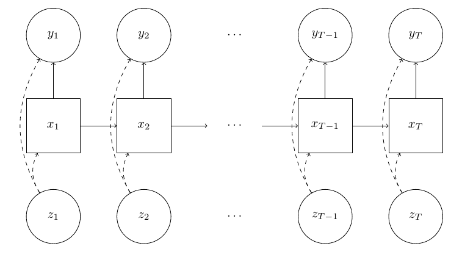

```{r, include = FALSE}
knitr::opts_chunk$set(
  collapse = TRUE,
  comment = "#>"
)
library(pfr)
#removed ths from yaml header:
#bibliography: REFERENCES.bib
# requires pandoc-citeproc, btu no way to make user download that
#knitr::opts_knit$set(root.dir = rprojroot::find_rstudio_root_file())
```


## The Big Picture

In `pf`, the c++ library, each model/algorithm pair gets its own class. Writing this class's methods defines a time series model, and the base class you choose to inherit from selects the particle filter that will be used. This typically requires writing two files: a c++ header file that declares the class, and a c++ source file that implements all the model specifics. 

In `pfR`, the R package, there is one extra step. In addition to the header and source file, there is some additional c++ code that helps you to use everything from within an R session. 

The beauty of this is that `pf` files are usable in `pfR`, and the majority of `pfR` code is usable in a c++ program. The downside to this is that R programmers will need a passing familiarity with c++--fortunately most of the c++ code is boilerplate, and `pfR` has a function that will write most of it for you. 


## Examples

Before we do any specific example, we'll have to define a state space model, and choose some notation. 

For $t =1, \ldots, T$, let $\{y_t\}$ be your observed time series, $\{x_t\}$ be some set of hidden states, and (optional) $\{z_t\}$ be a sequence of inputs you have at your disposal to help better predict each $y_t$. 

Defining a state-space model requires defining three kinds of distributions: 

 - $g(y_t \mid x_t, z_t, \theta)$ the observation distributions,
 - $f(x_t \mid x_{t-1}, z_t, \theta)$ the state transition distributions, and 
 - $\mu(x_t \mid z_t, \theta)$ an initial state distribution.


In the diagram below, circle nodes correspond with observed variables, square nodes represent hidden/latent variables, and arrows demonstrate how conditional dependence relationships (the dotted lines convey that they are optional).

```{r, out.width="100%", echo=F}

```


### Example 1: Univariate Stochastic Volatility with Leverage


Here's a state space model from @harvey_shephard @Yu that can help us understand a segment of univariate financial returns data $y_1, \ldots y_T$.

$$
\begin{gather*}
y_t = \exp(x_t/2)\epsilon_t, \hspace{10mm} t = 1, \ldots, T \\
  x_{t+1} = \mu + \phi(x_t - \mu) + \eta_t, \hspace{10mm} t = 1, \ldots, T-1 \\
x_1 \sim \mathcal{N}(\mu, \sigma^2 / (1-\phi^2)) \\
\begin{bmatrix}
\epsilon_t \\
\eta_t
\end{bmatrix}
\sim 
\mathcal{N}(\boldsymbol{0}, \boldsymbol{\Sigma})
\end{gather*}
$$

$\mathcal{N}(\cdot, \cdot)$ denotes a (possibly multivariate) Gaussian distribution, $-1 < \rho < 1$ is the leverage parameter (typically  negative for equities), and 

$$
\boldsymbol{\Sigma} = \begin{bmatrix}1  & \rho\sigma \\ \rho\sigma & \sigma^2 \end{bmatrix}.
$$
  
The interpretation of $x_t$ is the (logarithm of) the volatility of the returns and our covariate will be $z_t = y_{t-1}$. Writing this model in our notation yields

 - $g(y_t \mid x_t, z_t, \theta) = \mathcal{N}(0, \exp[x_t])$, 
 - $f(x_t \mid x_{t-1}, z_t, \theta) = \mathcal{N}(\mu + \phi(x_t - \mu) + \rho\sigma y_{t-1}\exp(-x_t/2), \sigma^2(1 - \rho^2))$, and
 - $\mu(x_t \mid z_t, \theta) = \mathcal{N}(\mu, \sigma^2 / (1-\phi^2))$ .


<!-- $$ -->
<!-- \begin{bmatrix} -->
<!-- x_{t+1} \\ -->
<!-- y_t -->
<!-- \end{bmatrix} -->
<!-- \mid -->
<!-- x_t -->
<!-- \sim -->
<!-- \mathcal{N} -->
<!-- \left( -->
<!-- \begin{bmatrix} -->
<!-- \mu + \phi(x_t - \mu)\\ -->
<!-- 0 -->
<!-- \end{bmatrix}, -->
<!-- \begin{bmatrix} -->
<!-- \sigma^2 & \exp[x_t/2]\rho\sigma^2 \\ -->
<!-- \exp[x_t/2]\rho\sigma^2 & \exp[x_t] -->
<!-- \end{bmatrix} -->
<!-- \right) -->
<!-- $$ -->
<!-- means -->


$f(x_t \mid x_{t-1}, z_t, \theta)$ is univariate normal with mean $\mu + \phi(x_t - \mu) + \rho\sigma y_{t-1}\exp[-x_t/2]$ and  variance $\sigma^2(1 - \rho^2)$.

### Coding It Up

Suppose that the algorithm we want is a bootstrap filter with covariates. Our next step is writing all the c++ code for this model and this algorithm. Here is the bit of code that will do most of the work for you. The first argument is the prefix for all of your filenames and will be used throughout the rest of your work. 


```{r, eval = FALSE}
library(pfr)
createPFCPPTemplates("svol_leverage", "BSWC", fileDir = "./")
```

This will save three files to your desktop--`svol_leverage_bswc.h`, `svol_leverage_bswc.cpp`, and `svol_leverage_bswc_export.cpp`--and then open them in an RStudio session. You will notice some `TODO`s in the files. Consider these as requests for you to fill in the details of your model.

After you are finished editing them, they should like something like [this](https://github.com/tbrown122387/pfR/blob/main/vignettes/svol_leverage_bswc.h), [this](https://github.com/tbrown122387/pfR/blob/main/vignettes/svol_leverage_bswc.cpp), and [this](https://github.com/tbrown122387/pfR/blob/main/vignettes/svol_leverage_bswc_export.cpp).


### Compiling The Code

To compile the code you just wrote, simply run


```{r,eval = FALSE}
svol_lev <- buildModelFuncs(".", "svol_leverage")
```

`svol_lev` is an Rcpp Module @rcpp object that holds all the functions that allow you to use your model. You can call these functions like this: 

```{r,eval = FALSE}
svol_lev$svol_leverage_bswc_approx_LL(rnorm(100), c(.9, 0.0, 1.0, -.2))
svol_lev$svol_leverage_bswc_approx_filt(rnorm(100), c(.9, 0.0, 1.0, -.2))
```


### Example 2: A Factor Multivariate Stochastic Volatility Model


Here's another state space model from @multiv_stochvol that can handle multivariate returns data $\mathbf{y}_1, \mathbf{y}_2, \ldots$. 

$$
\begin{gather*}
\mathbf{y}_t = \mathbf{B} \mathbf{f}_t + \mathbf{V}_t^{1/2} \boldsymbol{\epsilon}_t, \hspace{10mm} \boldsymbol{\epsilon}_t \sim \mathcal{N}_p(\boldsymbol{0}, \mathbf{I}) \\
\mathbf{f}_t =  \mathbf{D}_t^{1/2} \boldsymbol{\gamma}_t, \hspace{10mm} \boldsymbol{\gamma}_t \sim \mathcal{N}_q(\boldsymbol{0}, \mathbf{I}) \\
\mathbf{x}_{t+1} = \boldsymbol{\mu} + \boldsymbol{\Phi} (\mathbf{x}_{t} - \boldsymbol{\mu}) + \boldsymbol{\eta}_t,  \hspace{10mm} \boldsymbol{\eta}_t \sim \mathcal{N}_{p+q}(\boldsymbol{0}, \boldsymbol{\Sigma} ) \\\\
\mathbf{x}_1 \sim \mathcal{N}(\boldsymbol{\mu},  \text{diag}(\sigma^2_1/(1-\phi_1^2), \ldots, \sigma^2_{p+q}/(1-\phi_{p+q}^2)  ) ) \\
\end{gather*}
$$

where
$$
\begin{gather*}
\mathbf{V}_t = \text{diag}[\exp(x_{1,t}), \ldots, \exp(x_{p,t}) ], \\
\mathbf{D}_t = \text{diag}[\exp(x_{p+1,t}), \ldots, \exp(x_{p+q,t}) ], \\
\boldsymbol{\Phi} = \text{diag}(\phi_1, \ldots, \phi_{p+q}), \\
\boldsymbol{\Sigma} = \text{diag}(\sigma^2_1, \ldots, \sigma^2_{p+q}) ,
\end{gather*}
$$

$p$ is the number of observations, and $q$ is the number of factors.

Suppose you want to use an auxiliary particle filter @apf for this model. The c++ file templates are generated with 

```{r, eval = FALSE}
createPFCPPTemplates("mean_factor_msvol", "APF", fileDir = "./")
```

The finished files look like the ones location [here](https://github.com/tbrown122387/pfR/blob/main/vignettes/mean_factor_msvol_apf.cpp), [here](https://github.com/tbrown122387/pfR/blob/main/vignettes/mean_factor_msvol_apf.h) and [here](https://github.com/tbrown122387/pfR/blob/main/vignettes/mean_factor_msvol_apf_export.cpp). That code is compiled with

```{r}
fsvol <- buildModelFuncs(".", "mean_factor_msvol")
```

and the (approximate) log-likelihood and filtering functions are run with

```{r}
paramEst <- c(1.22, #B
              -1.17, -.01, .08, #mu
              .85, .84, .81, #Phi
              3.7, 3.4, 3.49) #Sigma
fakeData <- matrix(rnorm(50), ncol=2)
fsvol$mean_factor_msvol_apf_approx_LL(fakeData, paramEst)
fsvol$mean_factor_msvol_apf_approx_filt(fakeData, paramEst)
```


## References
